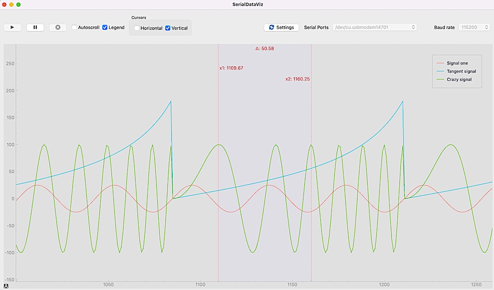

# Serial Data Plotter
Plot data from the serial port. Time series plots, XY plots and scatter plots are supported at the moment.

Data can be just numbers separated by comas or spaces, or named variables.

 


## Requeriments
Python >= 3.8   (I believe, not tested)

## Installation
#### Clone the github repository
```
git clone https://github.com/aresta/serialdataviz
cd serialdataviz
```
#### Install a Python virtual environment (Optional)
```
python -m venv 
. activate
```
#### Install dependencies
```
pip install -r requirements.txt
```

## Run
```
py serialdataviz.py
```

## Serial Data formats
You should send the values in the serial port with one of the next formats, depending on the plot type and if you want to name the variables.

The plot type can be selected in the configuration dialog of the application.
### Time series
- One number per line.
```
10.58
13.84
16.80
-19.38
-21.52
```
- Several numbers per lines, separated by comas or spaces. Each number will get a default variable name: Var1, Var2...
```
10.58,70.67,-6.27
13.84,72.12,36.46
16.80,73.60,72.71
24.95,83.35,-41.07
24.42,85.13,-78.28
```
- Several data pairs, separated by comas or spaces:  
```
<var_name>:number
```
```
Signal_A:10.58,Singnal_B:70.67,Another:-6.27
Signal_A:13.84,Singnal_B:72.12,Another:36.46
Signal_A:16.80,Singnal_B:73.60,Another:72.71
Signal_A:24.91,Singnal_B:81.62,Another:4.77
Signal_A:24.95,Singnal_B:83.35,Another:-41.07
Signal_A:24.42,Singnal_B:85.13,Another:-78.28
```
 

### XY plot and Scatter plot
- Two numbers *x,y* per line, separated by comas or spaces.
- Several pairs, separated by semicolons. Each pair will get a default variable name: Var1, Var2...
```
number,number;
```
- Several groups of var names and values , separated by semicolons:
```
<var_name>:number,number;
```
 

Take into account that the variable names and the data structure will be parsed only from the first valid line received.  The application expects that all lines will have the same structure, so you shouldn't change the order of the variables on the fly.

## Cursors

You can use the cursors to measure positions or relative distances. 

In the time series plot if you configure the rate of each received sample (in seconds, milliseconds or microsenconds), the X axis will show the time units and the cursor delta will show also the frequency.

 

## License
Distributed under the GPL v3.0 or later License. See the LICENSE file in the root of the project for more information.


